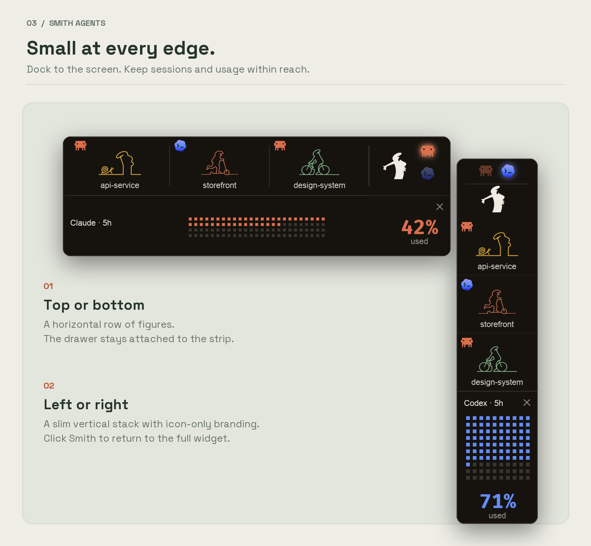
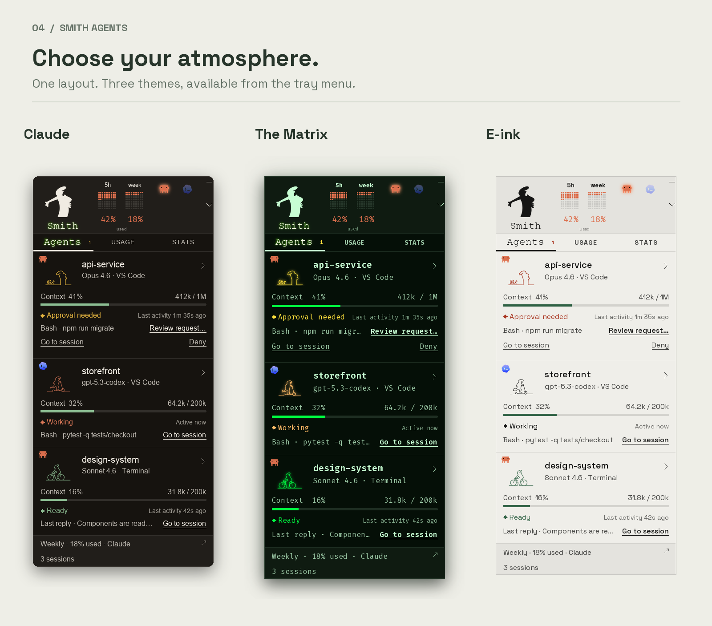

<p align="center">
  
</p>

<p align="center">
  <em>“We're not here because we're free. We're here because we're not free.”</em>
</p>

**Your agents. At a glance.**

**Smith Agents** is a small floating desktop widget for **Claude Code and Codex** on **Windows and macOS**.
Check your usage, see which sessions are working or ready, and open the agent you need.
Tuck it against a screen edge when you want your workspace back.

[Get started](#get-started) · [How it works](#how-it-works) · [Codex setup](docs/codex.md) · [Privacy](#privacy) · [Development](docs/development.md)

## A little less window hunting

- **Claude and Codex together.** See local terminal and VS Code sessions in one agent list, with a provider logo on each figure.
- **Usage you can read at a glance.** Switch providers, check account limits and stats, or click the header to cycle through **Used % → Remaining % → Reset time/day**.
- **A figure for every session.** Working, waiting, and ready states have their own poses. Each session keeps its figure until its state changes; subagents get a Little helper.
- **Small when you need it.** Tuck along the **top, left, or right** edge. Project names wrap, larger lists scroll, and clicking a figure opens just that agent's panel.
- **Context without opening every chat.** See the model, context tokens, recent activity, and last request. Missing readings stay visibly unknown.
- **Open it. Hide it. Keep it running.** Bring a matched agent window forward or hide it from its panel. Hiding a window leaves the session running.

## Keep your workspace



Park the strip along the **top, left, or right** edge. Click a figure to open
that agent's panel, then click it again to tuck the panel away. Other sessions
keep running.

## Three ways to feel at home



**Claude · The Matrix · E-ink**

The figures share the same body scale across poses. Animations settle into subtle
idle; tucked figures replay a short entrance once a minute.

*Images use sample data rendered by the app. They contain no live account or conversation data.*

## Get started

### One-line install

Install **Python 3.10+** first ([python.org](https://www.python.org/downloads/)).
On Windows, include the Python launcher (`py`). You also need Claude Code or Codex
installed and signed in.

**Windows · PowerShell**

```powershell
irm https://raw.githubusercontent.com/richieaprile661/smith-agents/master/install.ps1 | iex
```

**macOS · Terminal**

```sh
curl -fsSL https://raw.githubusercontent.com/richieaprile661/smith-agents/master/install.sh | sh
```

Each command installs Smith Agents into its own environment and launches it.
Windows gets a Start Menu shortcut; Mac gets an app in your user Applications
folder. Your agent logins and widget settings stay in their existing locations. No Git installation or manual cloning is needed.

**To update:** quit Smith Agents from its tray/menu-bar menu, then run the same
one-line command again. It reinstalls the latest code and launches the updated
widget, preserving your settings and agent logins. Claude and Codex sessions
can keep running. Updates are manual; there is no automatic update checker.
If you used a custom installation directory, use the same override when updating.

[Windows installer](install.ps1) · [Mac installer](install.sh) ·
[Windows setup](docs/windows.md) · [Mac setup](docs/macos.md)

<details>
<summary>Install from source / development setup</summary>

You need Python 3.10+ and Git. The Python package is `smith_agents`.

```sh
git clone https://github.com/richieaprile661/smith-agents.git
cd smith-agents
```

**Windows · PowerShell**

```powershell
py -m pip install -e .
.\run.cmd
```

**macOS · Terminal**

```sh
python3 -m venv .venv
.venv/bin/python -m pip install -e .
.venv/bin/python -m smith_agents
```

Try sample data without signing in with `py -m smith_agents --demo` on Windows
or `.venv/bin/python -m smith_agents --demo` on Mac.

When updating an older checkout, reinstall with the command above. If startup
or optional context/hooks were configured against the old package path, rerun
that setup using the updated scripts.

</details>

## How it works

1. **Start an agent.** Open Claude Code or Codex in a local terminal or supported VS Code setup. Give the widget a few seconds to detect it.
2. **Check in.** Use **Agents** for sessions and **Usage / Stats** for the selected provider. Click a row for its details.
3. **Tuck it away.** Use the small tuck control, then drag the strip along the top or either side. Click a figure to open its panel; click it again or use the panel's close button to put it away.
4. **Bring the right window forward.** Use **Open terminal**, **Open chat**, or **Open window**. The action becomes **Hide** after the window is opened.

The tray/menu-bar menu contains refresh, theme, size, visibility, and startup settings.
The widget saves your provider and tuck position across restarts.

### Reopen after quitting

- **Windows:** open Start, search **Smith Agents**, and launch it. You can pin it to Start or the taskbar.
- **Mac:** press **⌘ Space**, search **Smith Agents**, and press Enter. The installer also puts the app in `~/Applications`; drag it onto the Dock for quick access.
- **Hidden but still running:** open its tray/menu-bar menu and choose **Show console**.

To start automatically when you sign in, enable **Start with Windows** or
**Start at login** in the tray/menu-bar menu.

### A few useful distinctions

| Reading or control | What it means |
| --- | --- |
| Usage percentage | The provider's account quota reading. Refreshes roughly every five minutes, or with **Refresh now**. |
| Context | The latest reported request context, not the sum of an entire conversation. A `?` means capacity is unavailable. |
| Stats | Each provider's available activity data. Claude and Codex token totals use different definitions and are shown separately. |
| Hide | Minimizes the matched window and keeps the agent running. Window/tab matching depends on the host application. |
| End session… | Asks for confirmation before stopping a verified, independent Claude session. Codex sessions show **End in Codex**. |
| Allow / Deny | Available for supported Claude permission requests after the optional bridge is configured. Codex approvals remain in Codex. |

Local Windows and macOS sessions are supported. WSL, SSH, containers, and remote
extension hosts need a bridge in their own environment and are not currently connected.
See [Codex compatibility](docs/codex.md#compatibility-and-validation) for the tested setups.

## Privacy

- **No telemetry or analytics.** Session previews are read locally and are not uploaded by the widget.
- **No credential copies.** Claude's existing login is sent to Anthropic's usage endpoint. Codex manages its own authentication through its local App Server. Credentials are not saved in widget settings, logs, or caches.
- **No model turns to fetch usage.** Account readings do not start conversations or generate agent tasks.
- **An isolated demo.** `--demo` uses temporary settings and sample data, without reading credentials or sessions or requesting usage.

Settings and cached readings stay in your local application-data folder.
Existing installations retain their saved settings and provider connections.
Optional context and permission integrations are documented in the platform
setup guides.

## Feedback and development

Found something that needs attention? [Open an issue](https://github.com/richieaprile661/smith-agents/issues)
with your OS, agent/client, theme, and steps to reproduce it. Remove private
project names, conversations, and credentials from any screenshots or logs you share.

The shared tests and native demo launch run in CI on Windows and macOS.
See [development and artwork notes](docs/development.md) to run the checks or preview the figures.

## Credits and license

Inspired by [codenotch](https://github.com/vinzdg/codenotch), with its own floating
console, artwork, and themes.

Code: [MIT](LICENSE). Bundled Fira Code and Space Grotesk fonts use the included
SIL Open Font License files.

This project is not affiliated with Anthropic or OpenAI.
