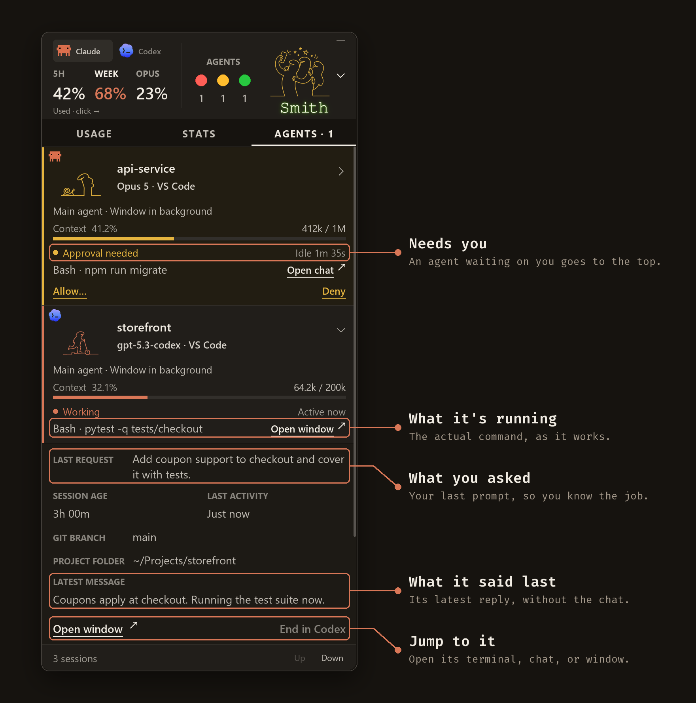

<p align="center">
  
</p>

<p align="center">
  <em>"We're not here because we're free. We're here because we're not free."</em>
</p>

**Smith Agents** is a small floating widget for **Claude Code** and **Codex** on
**Windows** and **macOS**. It shows every agent you have running, what each one
is doing, which ones need you, and how much of your usage is left, while you keep
working in your editor.

[Install](#install) · [How it works](#how-it-works) · [Codex setup](docs/codex.md) · [Privacy](#privacy) · [Development](docs/development.md)

## Why Smith Agents

- **Keep working while your agents run.** Tuck the widget against the top, left,
  or right edge of your screen. Each agent appears as a small figure whose pose
  and color show its state, so a glance tells you who's working, who's done, and
  who's waiting.
- **See the actual work, not just "busy".** Every session shows the command it's
  running, updated about once a second. Open a session to see your last request,
  its latest reply, the Git branch, how long it's been running, and how full its
  context is.
- **Catch a stuck agent before it costs you.** When a Claude session goes quiet in
  the middle of a task for 90 seconds, it turns yellow and moves to the top of
  the list. Approval requests show up the same way. An agent waiting on you for an
  hour is an hour of paid time spent doing nothing, and Smith Agents points it out
  in minutes.
- **Jump between agents, with your usage in view.** Bring any agent's terminal,
  chat, or window to the front in one click, or hide it again. Your Claude and
  Codex limits sit in the header, including the 5-hour and weekly windows. They
  refresh every five minutes, or immediately when you ask.

## See what every agent is doing



Sessions that need you sort to the top. For Claude Code in VS Code, you can allow
or deny a pending request from the widget after you set up the optional bridge
([Windows](docs/windows.md), [Mac](docs/macos.md)). Other requests show which app
to answer them in.

## Tuck it away and keep working


The tucked strip keeps one figure per agent along the edge of your screen. Click
a figure to open that agent's panel, and click it again to put the panel away.
The agents keep running either way.

## Pick a theme


Choose **Claude**, **The Matrix**, or **E-ink** from the tray or menu-bar menu.

*The images show sample sessions rendered by the widget itself. They contain no
real account or conversation data.*

## Install

You need the following:

- Python 3.10 or later from [python.org](https://www.python.org/downloads/). On
  Windows, include the Python launcher (`py`).
- Claude Code or Codex, installed and signed in.

To install Smith Agents, run the command for your system.

**Windows (PowerShell)**

```powershell
irm https://raw.githubusercontent.com/richieaprile661/smith-agents/master/install.ps1 | iex
```

**macOS (Terminal)**

```sh
curl -fsSL https://raw.githubusercontent.com/richieaprile661/smith-agents/master/install.sh | sh
```

The command installs Smith Agents into its own Python environment and starts it.
On Windows, it adds a Start menu shortcut. On macOS, it adds the app to
`~/Applications`. You don't need Git.

### Update

1. Quit Smith Agents from its tray or menu-bar menu.
2. Run the same install command again.

The installer replaces the code with the version on `master` and starts the
widget. Your settings and agent logins stay as they are, and your Claude and Codex
sessions can keep running. Smith Agents doesn't check for updates on its own. If
you installed to a custom folder with `SMITH_AGENTS_INSTALL_DIR`, set it to the
same folder when you update.

<details>
<summary>Install from source</summary>

You need Python 3.10 or later and Git. The Python package is `smith_agents`.

```sh
git clone https://github.com/richieaprile661/smith-agents.git
cd smith-agents
```

**Windows (PowerShell)**

```powershell
py -m pip install -e .
.\run.cmd
```

**macOS (Terminal)**

```sh
python3 -m venv .venv
.venv/bin/python -m pip install -e .
.venv/bin/python -m smith_agents
```

To try it with sample data and without signing in, add `--demo`:
`py -m smith_agents --demo` on Windows, or `.venv/bin/python -m smith_agents --demo`
on macOS.

</details>

## How it works

1. **Start an agent.** Open Claude Code or Codex in a terminal or in VS Code.
   Smith Agents finds it within a few seconds.
2. **Check in.** The **Agents** tab lists your sessions. **Usage** and **Stats**
   show readings for the selected provider. Click a session to see its details.
3. **Tuck it away.** Click the tuck control, then drag the strip along the top or
   either side of the screen.
4. **Go to an agent.** Click **Open terminal**, **Open chat**, or **Open window**.
   If that window is already open, the link reads **Hide** instead.

The tray or menu-bar menu has settings for refresh, theme, size, visibility, and
starting at sign-in. The widget remembers your provider and tuck position.

### Reopen after you quit

- **Windows:** Open **Start**, search for **Smith Agents**, and open it. You can
  pin it to Start or the taskbar.
- **macOS:** Press **Command+Space**, search for **Smith Agents**, and press
  **Return**. You can drag the app from `~/Applications` to the Dock.
- **Hidden but still running:** In the tray or menu-bar menu, click
  **Show console**.

To start Smith Agents when you sign in, turn on **Start with Windows** or
**Start at login** in the same menu.

### Readings and controls

| Reading or control | What it means |
| --- | --- |
| Usage percentage | Your account's limit reading from the provider. Refreshes about every five minutes, or when you click **Refresh now**. Click the header to switch between used, remaining, and reset time. |
| Context | How much of the session's context window the latest request used, not a total for the whole conversation. `?` means the capacity isn't available. |
| Quiet · check chat | A Claude session stopped in the middle of a task and hasn't written anything for 90 seconds. It might be waiting for you, or running a long command. |
| Approval needed | A supported Claude Code request in VS Code is waiting. Click **Allow** to review it, or **Deny**. Requires the optional bridge. |
| Stats | Each provider's activity data. Claude and Codex count tokens differently, so they're shown separately. |
| Hide | Minimizes the agent's window. The agent keeps running. |
| End session | Asks before it stops a verified, standalone Claude session. For Codex sessions, the panel shows **End in Codex**. |

Smith Agents supports sessions on the same Windows or macOS computer. It doesn't
connect to agents in WSL, over SSH, in containers, or in remote VS Code sessions.
For the Codex setups that have been tested, see
[Codex compatibility](docs/codex.md#compatibility-and-validation).

## Privacy

- **No telemetry or analytics.** Session details are read on your computer and
  aren't uploaded anywhere.
- **No copies of your credentials.** Claude's existing login is sent only to
  Anthropic's usage endpoint. Codex handles its own sign-in through its local App
  Server. Smith Agents doesn't save credentials in its settings, logs, or caches.
- **No model calls to read usage.** Checking your limits doesn't start a
  conversation or run an agent task.
- **A separate demo.** `--demo` uses temporary settings and sample data. It
  doesn't read credentials or sessions, or request usage.

Settings and cached readings stay in your local application data folder. For the
optional context and approval bridges, see the [Windows setup](docs/windows.md)
and [Mac setup](docs/macos.md).

## Feedback and development

If something isn't working, [open an issue](https://github.com/richieaprile661/smith-agents/issues).
Include your OS, the agent and app you use, the theme, and the steps to reproduce
it. Remove private project names, conversations, and credentials from any
screenshots or logs.

CI runs the tests and a sample-data launch on Windows and macOS. To run the checks,
preview the figures, or regenerate these images, see
[Development and artwork](docs/development.md).

## Credits and license

Inspired by [codenotch](https://github.com/vinzdg/codenotch), with its own
widget, artwork, and themes.

The code is released under the [MIT License](LICENSE). The bundled Fira Code and
Space Grotesk fonts use the included SIL Open Font License files.

This project isn't affiliated with Anthropic or OpenAI.
