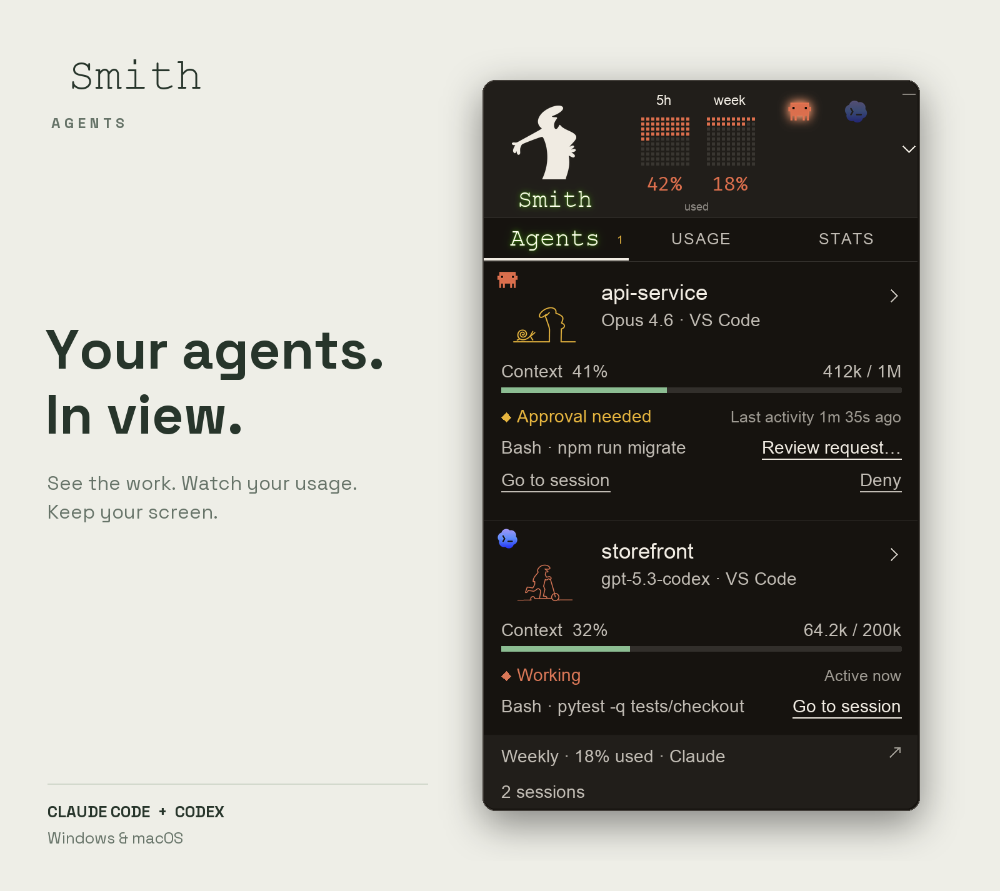
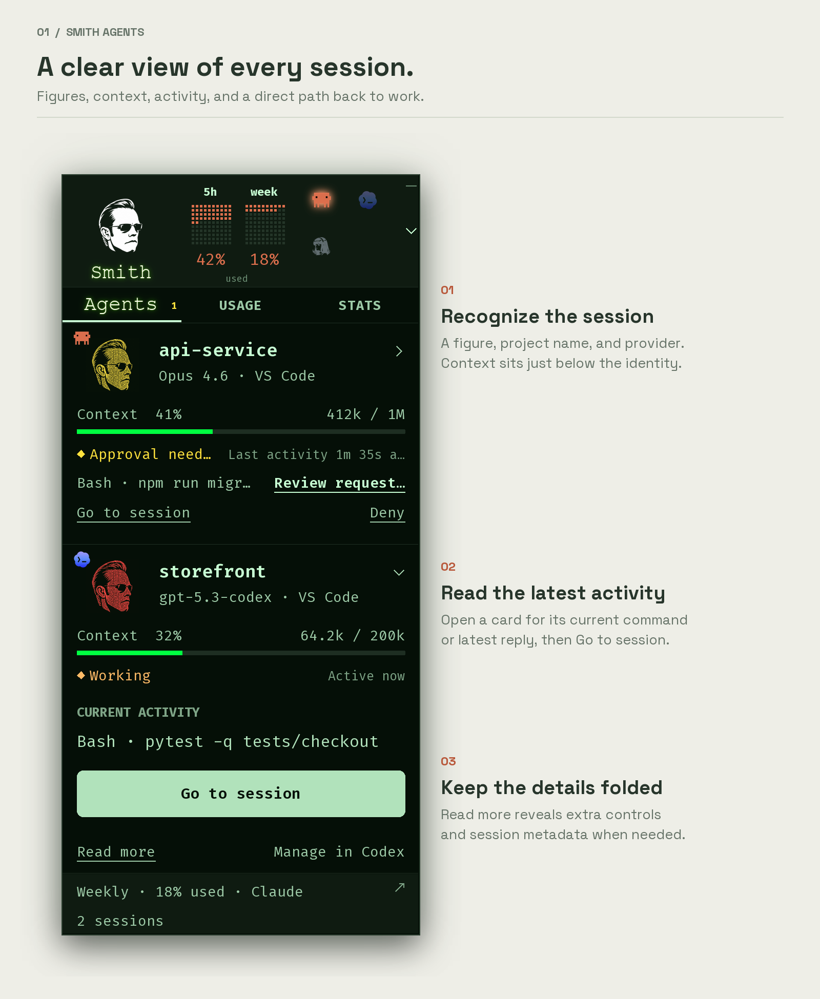
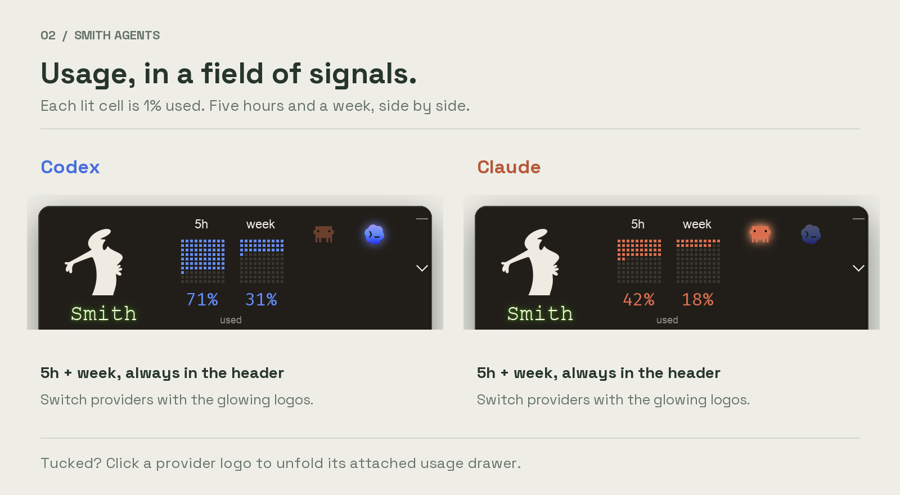
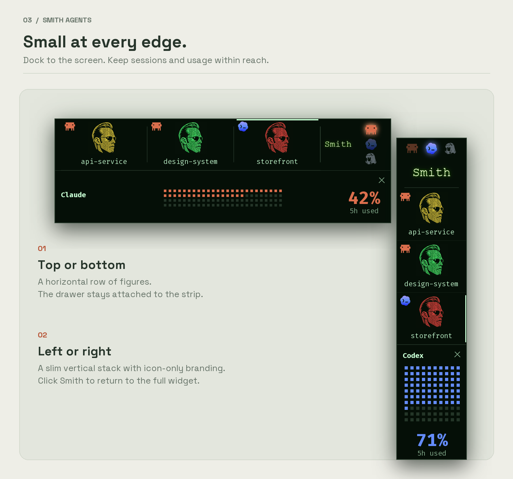
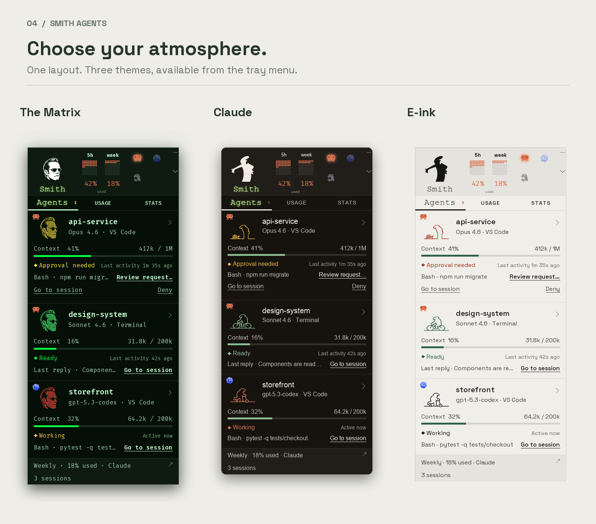

<p align="center">
  
</p>

**Smith Agents** keeps your **Claude Code**, **Codex**, and **Hermes Agent** sessions in view on
**Windows and macOS**. See what your agents are doing, check account usage, and
jump back to a session from a small floating widget or a strip at the edge of
your screen.

[Install](#install) · [Sessions](#your-sessions-at-a-glance) · [Usage](#usage-in-a-field-of-signals) · [Screen edges](#small-at-every-edge) · [Codex setup](docs/codex.md) · [Hermes setup](docs/hermes.md)

| Follow the work | Watch your usage | Keep your screen |
| --- | --- | --- |
| Figures, context, and current activity for each session. | Separate **5h** and **week** fields, in your provider's color. | Tuck to any screen edge, with details and usage a click away. |

## Your sessions at a glance



Click a session to open its current activity or latest reply. **Go to session**
brings you back to its app. Extra controls and metadata stay folded under
**Read more**.

Sessions marked as needing attention sort to the top. Yellow can mean a pending
request, a quiet session, or unavailable activity information; check the status
text for the reason. It doesn't always mean there's a question to answer.

For supported Claude Code requests in VS Code, the optional approval bridge lets
you review and allow or deny them from the widget
([Windows setup](docs/windows.md), [Mac setup](docs/macos.md)). Other requests point
you to the app where you can answer.

## Usage, in a field of signals



The header shows **5-hour and weekly usage together**. Each lit cell represents
**1% used**: blue for Codex, orange for Claude. Click a glowing provider logo to
switch providers. A missing reading shows **—**, not zero.

The **Usage** tab keeps the detailed limits and reset times. Readings refresh
about every five minutes, or through **Refresh now** in the tray menu.

## Small at every edge



Tuck to the **top, bottom, left, or right edge of your screen**, independent of
editor and terminal windows.

- **Click a figure** to open its session panel inward from the edge.
- **Click a provider logo** to unfold the attached usage drawer.
- **Click the drawer reading** to cycle through available limits, including 5h and week.
- **Click the Smith icon** to return to the full widget.

## Pick a theme



Choose **Claude**, **The Matrix**, or **E-ink** from the tray or menu-bar menu.

*All images use sample sessions and usage readings rendered by the actual widget.
No real account or conversation data is shown.*

## Install

You need the following:

- Python 3.10 or later from [python.org](https://www.python.org/downloads/). On
  Windows, include the Python launcher (`py`).
- Claude Code, Codex, or Hermes Agent, installed and configured.

To install Smith Agents, run the command for your system.

**Windows (PowerShell)**

```powershell
irm https://raw.githubusercontent.com/richieaprile661/smith-agents/master/install.ps1 | iex
```

**macOS (Terminal)**

```sh
curl -fsSL https://raw.githubusercontent.com/richieaprile661/smith-agents/master/install.sh | sh
```

The command installs Smith Agents into its own Python environment and starts it.
On Windows, it adds a Start menu shortcut. On macOS, it adds the app to
`~/Applications`. You don't need Git.

### Update

1. Quit Smith Agents from its tray or menu-bar menu.
2. Run the same install command again.

The installer replaces the code with the version on `master` and starts the
widget. Your settings and agent logins stay as they are, and your Claude and Codex
sessions can keep running. Smith Agents doesn't check for updates on its own. If
you installed to a custom folder with `SMITH_AGENTS_INSTALL_DIR`, set it to the
same folder when you update.

<details>
<summary>Install from source</summary>

You need Python 3.10 or later and Git. The Python package is `smith_agents`.

```sh
git clone https://github.com/richieaprile661/smith-agents.git
cd smith-agents
```

**Windows (PowerShell)**

```powershell
py -m pip install -e .
.\run.cmd
```

**macOS (Terminal)**

```sh
python3 -m venv .venv
.venv/bin/python -m pip install -e .
.venv/bin/python -m smith_agents
```

To try it with sample data and without signing in, add `--demo`:
`py -m smith_agents --demo` on Windows, or `.venv/bin/python -m smith_agents --demo`
on macOS.

</details>

## How it works

1. **Start an agent.** Open Claude Code, Codex, or a local Hermes chat.
   Smith Agents finds it within a few seconds.
2. **Check in.** The **Agents** tab lists your sessions. **Usage** and **Stats**
   show readings for the selected provider. Click a session to see its details.
3. **Tuck it away.** Click the tuck control, then drag the strip along any
   of the four screen edges.
4. **Go to an agent.** Click **Go to session**. Open **Read more** for extra
   window controls and session metadata.

The tray or menu-bar menu has settings for refresh, theme, size, visibility, and
starting at sign-in. The widget remembers your provider and tuck position.

### Reopen after you quit

- **Windows:** Open **Start**, search for **Smith Agents**, and open it. You can
  pin it to Start or the taskbar.
- **macOS:** Press **Command+Space**, search for **Smith Agents**, and press
  **Return**. You can drag the app from `~/Applications` to the Dock.
- **Hidden but still running:** In the tray or menu-bar menu, click
  **Show console**.

To start Smith Agents when you sign in, turn on **Start with Windows** or
**Start at login** in the same menu.

### Readings and controls

| Reading or control | What it means |
| --- | --- |
| Usage percentage | The percentage **used** of a provider limit. Each lit Signal Field cell is 1%. Open **Usage** for all limits and reset times; a missing reading shows **—**. |
| Context | How much of the session's context window the latest request used, not a total for the whole conversation. `—` means the token reading is missing; `?` means the capacity is unknown. |
| Quiet · check chat | A Claude session hasn't written activity for 90 seconds during an unfinished turn. It might be waiting for you, or running a long command. |
| Approval needed | A supported Claude Code request in VS Code is waiting. Click **Review request** to review it, or **Deny**. Requires the optional bridge. |
| Stats | Each provider's activity data. Claude and Codex count tokens differently, so they're shown separately. |
| Hide | Minimizes the agent's window. The agent keeps running. |
| End session | Asks before it stops a verified, standalone Claude session. Codex and Hermes sessions are ended in their own apps. |

Hermes cards show locally saved requests, replies, and tool names with its
portrait logo. Activity is best effort and may lag while Hermes streams a reply.
Hermes Usage shows saved session tokens, estimated cost, and model breakdowns;
Stats shows saved API calls, tool calls, and messages. Hermes context readings,
account quotas, approvals, and delegated helpers are not yet connected.
See [Hermes compatibility and setup](docs/hermes.md).

Smith Agents supports sessions on the same Windows or macOS computer. It doesn't
connect to agents in WSL, over SSH, in containers, or in remote VS Code sessions.
For the Codex setups that have been tested, see
[Codex compatibility](docs/codex.md#compatibility-and-validation).

## Privacy

- **No telemetry or analytics.** Session details are read on your computer and
  aren't uploaded anywhere.
- **No copies of your credentials.** Claude's existing login is sent only to
  Anthropic's usage endpoint. Codex handles its own sign-in through its local App
  Server. Smith Agents doesn't save credentials in its settings, logs, or caches.
- **No model calls to read usage.** Checking your limits doesn't start a
  conversation or run an agent task.
- **A separate demo.** `--demo` uses temporary settings and sample data. It
  doesn't read credentials or sessions, or request usage.

Settings and cached readings stay in your local application data folder. For the
optional context and approval bridges, see the [Windows setup](docs/windows.md)
and [Mac setup](docs/macos.md).

## Feedback and development

If something isn't working, [open an issue](https://github.com/richieaprile661/smith-agents/issues).
Include your OS, the agent and app you use, the theme, and the steps to reproduce
it. Remove private project names, conversations, and credentials from any
screenshots or logs.

CI runs the tests and a sample-data launch on Windows and macOS. To run the checks,
preview the figures, or regenerate these images, see
[Development and artwork](docs/development.md).

## Credits and license

Inspired by [codenotch](https://github.com/vinzdg/codenotch), with its own
widget, artwork, and themes.

The code is released under the [MIT License](LICENSE). The bundled Fira Code and
Space Grotesk fonts use the included SIL Open Font License files.

This project isn't affiliated with Anthropic, OpenAI, or Nous Research.
